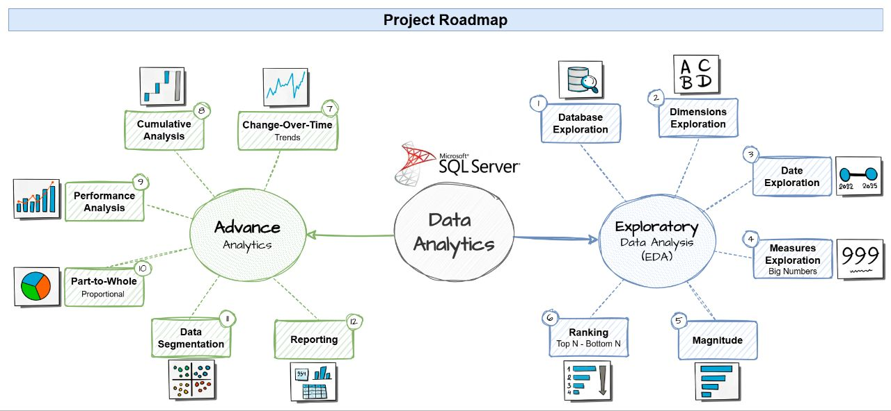

# SQL Data Analytics Project
Welcome to the **SQL Data Analytics Project** repository! 🚀  
This repository contains a collection of SQL scripts demonstrating various analytical techniques, such as ranking, changes over time, cumulative, data segmentation and part-to-whole analysis.

---
## 🗺️ Project Roadmap
The project roadmap, which includes **Exploratory Data Analysis (EDA)** and **Advanced Analytics**, is as follows:



---
## 🔎 Project Requirements
### 📋 BI: Analytics & Reporting (Data Analysis)

#### Objective
Develop SQL-based analytics to deliver detailed insights into:
- **Customers Behavior**
- **Products Performance**
- **Sales Trends**

These insights empower stakeholders with key business metrics, enabling strategic decision-making.

---
## 📂 Repository Structure
```
sql-data-analytics-project/
│
├── datasets/                      # Clean and business-ready datasets used for the project
│
├── docs/                          # Project documentation
│   ├── data_model.png             # A diagram showing the data model (star schema)
│   ├── project_roadmap.png        # A diagram showing the project roadmap
│
├── scripts/                       # SQL scripts for build the database, data analysis and reports
│
├── README.md                      # Project overview and instructions
├── LICENSE                        # License information for the repository
```

---
## 🛡️ License

This project is licensed under the [MIT License](LICENSE). You are free to use, modify, and share this project with proper attribution.

---
## 👨🏻‍💻 About Me

Hi there! I'm **Omid Zolfagahr Beigy**. I’m passionate about problem-solving and optimizing systems to enhance efficiency and performance. My core strengths lie in systems optimization, supported by skills in mathematical programming, data analysis, and machine learning.

Let's stay in touch! Feel free to connect with me on the following platforms:

[](https://linkedin.com/in/omidzbeigy)
